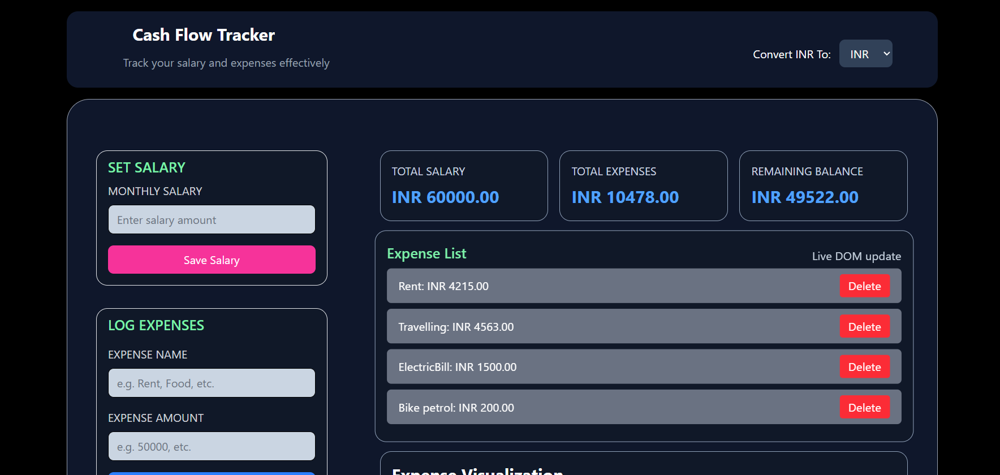

# Salary & Expense Tracker with Currency Converter

This project is a web-based application to help you manage your salary, track expenses, and view your financial summary in multiple currencies. It also allows you to download a PDF report of your cash flow.

## Features

- **Add Salary:** Enter your monthly salary and update it anytime.
- **Add Expenses:** Add, view, and delete expenses with names and amounts.
- **Live Summary:** See total salary, total expenses, and remaining balance instantly.
- **Currency Converter:** Switch between INR and other currencies (using live exchange rates).
- **Expense Chart:** Visual doughnut chart for expenses vs. remaining balance.
- **PDF Report:** Download a PDF summary of your cash flow and expenses.
- **Persistent Data:** All data is saved in your browser's local storage.

## How to Use

1. **Enter Salary:** Fill in your salary and submit.
2. **Add Expenses:** Enter expense name and amount, then add.
3. **Change Currency:** Use the currency dropdown to view all values in your preferred currency.
4. **Download PDF:** Click the PDF button to download your report.

## Technologies Used
- HTML, CSS, JavaScript
- [Chart.js](https://www.chartjs.org/) for charts
- [jsPDF](https://github.com/parallax/jsPDF) for PDF generation
- [ExchangeRate-API](https://www.exchangerate-api.com/) for currency rates

## Project Structure
```
index.html         # Main HTML file
script.js          # All app logic and UI updates
README.md          # This file
Prompts.md         # (Optional) Project prompts or notes


## Setup
1. Clone or download this repository.
2. Open `index.html` in your browser.
3. Make sure you are connected to the internet for currency rates and PDF features.

# Cash Flow Tracker

## Screenshots

### Dashboard


### Expense List


## License
This project is for educational/personal use. Feel free to modify and use it as you like.
